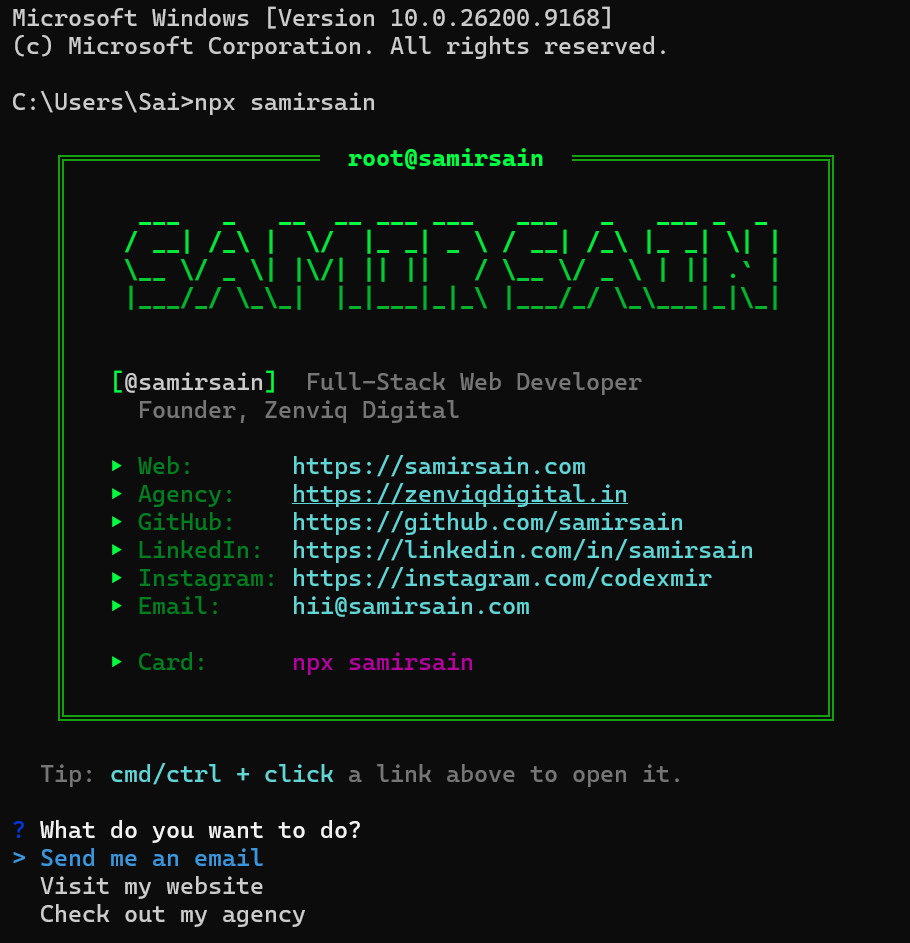

<div align="center">

```
 ▄▄▄▄▄▄▄▄▄▄▄▄▄▄▄▄▄▄▄▄▄▄▄▄▄▄▄▄▄▄▄▄▄▄▄▄▄▄▄▄▄▄▄▄▄▄▄▄▄▄▄▄▄▄▄▄▄▄
 █                                                          █
 █    ___   _   __  __ ___ ___   ___   _   ___ _  _         █
 █   / __| /_\ |  \/  |_ _| _ \ / __| /_\ |_ _| \| |        █
 █   \__ \/ _ \| |\/| || ||   / \__ \/ _ \ | || .` |        █
 █   |___/_/ \_\_|  |_|___|_|_\ |___/_/ \_\___|_|\_|        █
 █                                                          █
 █   >_ digital business card, compiled for your terminal   █
 █                                                          █
 ▀▄▄▄▄▄▄▄▄▄▄▄▄▄▄▄▄▄▄▄▄▄▄▄▄▄▄▄▄▄▄▄▄▄▄▄▄▄▄▄▄▄▄▄▄▄▄▄▄▄▄▄▄▄▄▄▄▄▀
```

[](https://www.npmjs.com/package/samirsain)
[](https://www.npmjs.com/package/samirsain)
[](package.json)
[](./LICENSE)

**`01001110 01011000 01010000`** — no install, no trace, runs and vanishes

</div>

<br>

```
┌──●──●──●──────────────────────────────────────────────────┐
│  sai@desktop: ~                                            │
├──────────────────────────────────────────────────────────┤
│  $ npx samirsain                                            │
└──────────────────────────────────────────────────────────┘
```

<div align="center">
  
</div>

---

### `[ payload ]`

running `npx samirsain` fetches this package, executes it once, and leaves
nothing behind on disk. what it does, in order:

```
[✓] clear terminal
[✓] render ASCII banner  — matrix-green gradient, figlet
[✓] render info card     — boxen, double-line border
[✓] print contact links  — web · agency · github · linkedin · instagram · email
[✓] spawn interactive menu
```

```
? What do you want to do?
> Send me an email
  Visit my website
  Check out my agency
  Follow on GitHub
  Connect on LinkedIn
  Follow on Instagram
  Just quit
```

pick one — it opens straight from the terminal via `open`, no copy-pasting links.

---

### `[ stack ]`

```
bin/index.js
├── figlet      → ASCII banner
├── chalk       → matrix-green gradient + colors
├── boxen       → the double-line terminal box
├── inquirer    → the interactive menu
└── open        → fires links/mailto from the shell
```

100% ESM (`"type": "module"`), so it runs on chalk 5 / boxen 8 / inquirer 14
without the classic `ERR_REQUIRE_ESM` crash older npx-card tutorials hit.

---

### `[ run locally ]`

```bash
$ git clone https://github.com/samirsain/npx-card.git
$ cd npx-card
$ npm install
$ node bin/index.js
```

### `[ ship it ]`

```bash
$ npm login
$ npm publish
```

```bash
# next release
$ npm version patch   # patch | minor | major
$ npm publish
```

---

<div align="center">

```
$ whoami
```

**Samir Sain** — Full-Stack Web Developer · Founder, [Zenviq Digital](https://zenviqdigital.in)

[](https://samirsain.com)
[](https://github.com/samirsain)
[](https://linkedin.com/in/samirsain)
[](https://instagram.com/codexmir)
[](mailto:hii@samirsain.com)

<sub>connection closed. `$ npx samirsain` to reopen.</sub>

</div>
